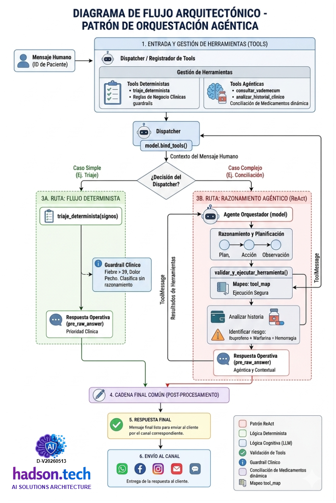
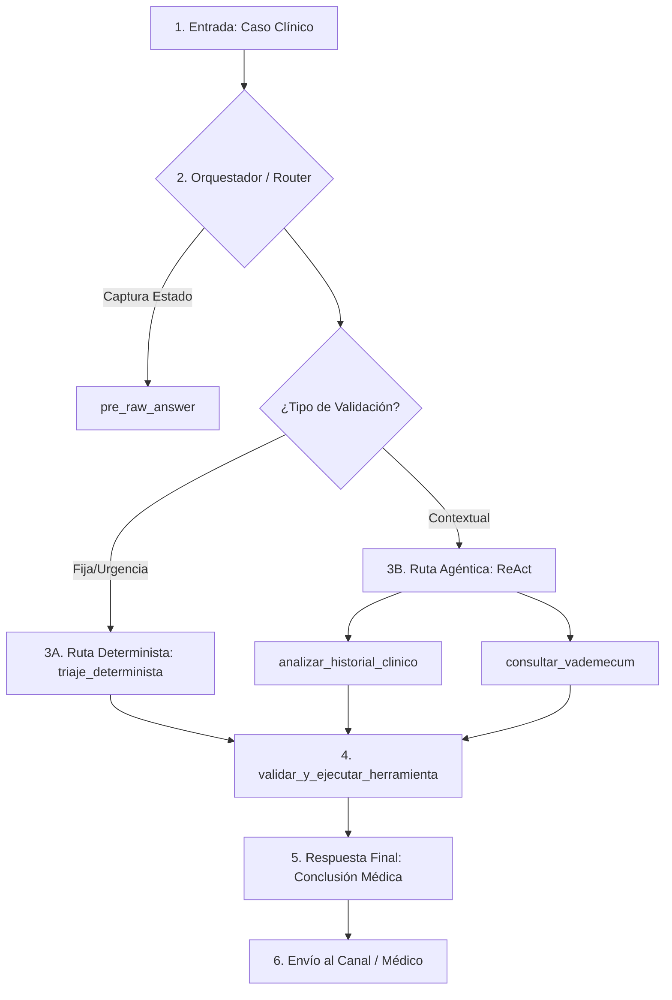

## Documentación de Agente de Triaje 
Agente de Triaje para Urgencias (Determinista) y Conciliación de Medicamentos y Diagnóstico (Agéntico). Implementación de un Agente utilizando Python y LangChain que combina un **flujo determinista** para el triaje y un **agente de razonamiento (ReAct)** para la conciliación médica.



---

### Implementación Híbrida
Este solución utiliza funciones decoradas con @tool para definir las capacidades del agente y un objeto ChatOpenAI para el razonamiento.
Se integrar haciendo uso del API Key de OpenAI, y se ha estructurado el script con una configuración clara de variables de entorno y comentarios detallados en cada bloque funcional.

A continuación, presento el diagrama arquitectónico detallado:

| Etapa | Descripción del Flujo Operativo |
| --- | --- |
| **1. ENTRADA** | **Mensaje del Paciente:** El sistema recibe el `caso_clinico`. Contiene parámetros críticos como la temperatura (39.5°C) y la intención de uso de fármacos (Ibuprofeno). |
| **2. ORQUESTADOR (GPT-4o)** | **Enriquecer y Clasificar:** El modelo analiza el texto inicial. Se dispara la función `pre_raw_answer` para generar una respuesta operativa técnica ("Generando llamadas a herramientas...") mientras se decide la ruta de ejecución. |
| **3A. RUTA DETERMINISTA** | **Triaje Clínico (Guardrails):** Se ejecuta `triaje_determinista`. Valida reglas de negocio médicas estrictas (ej. Fiebre > 39°C = Prioridad Alta) sin necesidad de razonamiento complejo. |
| **3B. RUTA AGÉNTICA** | **Razonamiento ReAct:** Para casos complejos, el agente utiliza las herramientas disponibles: `analizar_historial_clinico` (busca antecedentes como gastritis) y `consultar_vademecum` (valida interacciones con Warfarina). |
| **4. VALIDACIÓN SEGURA** | **Tool Execution:** Se utiliza el `tool_map` mediante `validar_y_ejecutar_herramienta`. Los resultados se empaquetan en un `ToolMessage` que regresa al modelo para la síntesis. |
| **5. RESPUESTA FINAL** | **Conclusión Médica:** El sistema procesa los hallazgos y emite el diagnóstico final, advirtiendo sobre riesgos (ej. Hemorragia por interacción Ibuprofeno/Warfarina) o confirmando la seguridad del tratamiento. |

---

### Representación Visual de la Lógica (Workflow)



### Elementos Clave del Diseño

* **Seguridad Híbrida:** Se separa la lógica lineal (triaje rápido) de la lógica de agente (análisis profundo de historial).
* **Transparencia:** El uso de `pre_raw_answer` permite al sistema informar al usuario o al registro de auditoría lo que está sucediendo antes de obtener el resultado final, mejorando la observabilidad del proceso médico.

---

### Consideraciones en la implementadas:

Para elevar el nivel del código a un estándar de producción con **LangChain**, utilizaremos `bind_tools` para vincular explícitamente las funciones al modelo y una lógica de ejecución que permita validar la existencia de las herramientas antes de su invocación.

1. **`bind_tools`**: Pasa la definición JSON de tus funciones de Python directamente al modelo de OpenAI, permitiéndole entender exactamente qué parámetros requiere cada una.
2. **`tool_map`**: Actúa como un registro centralizado. Si el modelo intenta llamar a una función que no está en este diccionario, la función de validación lo intercepta.
3. **Gestión de Mensajes**: Implementa el flujo correcto de mensajes de LangChain (`HumanMessage` -> `AIMessage` con `tool_calls` -> `ToolMessage`).
4. **Función Auxiliar**: `mostrar_tool_calls` te permite auditar en tiempo real qué está intentando hacer el agente antes de que ocurra la ejecución, esencial para depurar sistemas agénticos complejos.

---

### Desarrollo del agente de Triaje y Conciliación de Medicamentos y Diagnóstico según ReAct
Este diseño permite que el sistema mantenga la **seguridad** de las reglas clínicas fijas mientras aprovecha la **flexibilidad** de la IA para conectar puntos de datos complejos en el diagnóstico.

[Código Fuente disponible Jupyter Notebook](lcel-Agente-ReAct-Determinista-y-Agentico.ipynb)

> [!IMPORTANT]  
> Las herramientas permiten al agente "leer" y "aprender" del contexto del paciente.

```python

import os
import json
from typing import List, Dict, Any, Callable

# Componentes de LangChain
from langchain_openai import ChatOpenAI
from langchain_core.tools import tool
from langchain_core.messages import HumanMessage, ToolMessage, AIMessage

# =================================================================
# 1. CONFIGURACIÓN Y MODELO
# =================================================================
with open("content/clave_api.txt") as archivo:
    apikey = archivo.read().strip()

os.environ["OPENAI_API_KEY"] = apikey

# Definimos el modelo con temperatura 0 para precisión médica
model = ChatOpenAI(model="gpt-4o", temperature=0)

# =================================================================
# 2. DEFINICIÓN DE HERRAMIENTAS (TOOLS)
# =================================================================

@tool
def triaje_determinista(temperatura: float, dolor_pecho: bool) -> str:
    """Ejecuta el protocolo de triaje basado en reglas fijas de salud."""
    if temperatura > 39.0 or dolor_pecho:
        return "PRIORIDAD ALTA: Derivación inmediata a sala de urgencias."
    return "PRIORIDAD MEDIA/BAJA: Evaluación estándar."

@tool
def consultar_vademecum(medicamento: str) -> str:
    """Busca contraindicaciones de un medicamento específico."""
    db = {"Warfarina": "Anticoagulante. Interacción crítica con AINEs.", 
          "Ibuprofeno": "No usar en gastritis crónica."}
    return db.get(medicamento, "Sin contraindicaciones graves registradas.")

@tool
def analizar_historial_clinico(paciente_id: str) -> str:
    """Consulta el expediente digital del paciente."""
    return f"Expediente {paciente_id}: Antecedentes de gastritis. Toma Warfarina."

# Registro y vinculación de herramientas
tools = [triaje_determinista, consultar_vademecum, analizar_historial_clinico]
model_with_tools = model.bind_tools(tools)

# Diccionario para mapear nombres de strings a funciones ejecutables
tool_map = {tool.name: tool 
            for tool in tools}

# =================================================================
# 3. FUNCIONES AUXILIARES Y VALIDACIÓN
# =================================================================

def pre_raw_answer(ai_message: AIMessage) -> str:
    """
    Captura y formatea la respuesta operativa cruda del modelo 
    antes de la conciliación final.
    """
    content = ai_message.content
    if not content and ai_message.tool_calls:
        return "[Respuesta Técnica]: Generando llamadas a herramientas para validación clínica..."
    return content

def validar_y_ejecutar_herramienta(tool_call: Dict[str, Any]) -> ToolMessage:
    """Valida la existencia de la herramienta y la ejecuta de forma segura."""
    tool_name = tool_call["name"]
    tool_args = tool_call["args"]
    
    if tool_name not in tool_map:
        return ToolMessage(
            tool_call_id=tool_call["id"],
            content=f"Error: La herramienta '{tool_name}' no existe."
        )
    
    # Ejecución dinámica
    print(f"--- Ejecutando herramienta: {tool_name} ---")
    resultado = tool_map[tool_name].invoke(tool_args)
    return ToolMessage(tool_call_id=tool_call["id"], content=str(resultado))

def mostrar_tool_calls(ai_msg: AIMessage):
    """Muestra de forma legible las llamadas a herramientas propuestas por el modelo."""
    if not ai_msg.tool_calls:
        print("El modelo no solicitó herramientas.")
        return
    
    for call in ai_msg.tool_calls:
        print(f"🔧 Tool Call Detectada: {call['name']}")
        print(f"📦 Argumentos: {json.dumps(call['args'], indent=2)}")

# =================================================================
# 4. ORQUESTADOR DE CASO DE USO (Bucle de Ejecución)
# =================================================================

def ejecutar_caso_de_uso(consulta: str):
    """Bucle que permite al modelo razonar, usar herramientas y responder."""
    messages = [HumanMessage(content=consulta)]
    
    # Paso 1: El modelo razona y decide qué herramientas usar
    ai_msg = model_with_tools.invoke(messages)
    messages.append(ai_msg)

    # Captura de la respuesta operativa cruda inicial
    raw_obs = pre_raw_answer(ai_msg)
    print(f"\n🔍 OBSERVACIÓN PRE-PROCESADA: {raw_obs}")
    
    mostrar_tool_calls(ai_msg)
    
    # Paso 2: Si hay llamadas a herramientas, las ejecutamos
    if ai_msg.tool_calls:
        for tool_call in ai_msg.tool_calls:
            tool_msg = validar_y_ejecutar_herramienta(tool_call)
            messages.append(tool_msg)
        
        # Paso 3: El modelo genera la respuesta final con los datos obtenidos
        respuesta_final = model_with_tools.invoke(messages)
        print("\n✅ CONCLUSIÓN MÉDICA FINAL:")
        print(respuesta_final.content)
    else:
        print(ai_msg.content)

# =================================================================
# 5. EJECUCIÓN
# =================================================================
if __name__ == "__main__":
    caso_clinico = """
    Paciente ID-701 llega con 35 de fiebre y presenta dolor de pecho. Se planea recetar Paracetamol.
    Valida el triaje y si el medicamento es seguro según su historial.
    """
    ejecutar_caso_de_uso(caso_clinico)


```

---

#### ¿Qué hace cada bloque de código?

1. **Credenciales**: Establece el puente con OpenAI. Sin la `OPENAI_API_KEY`, el modelo no puede procesar los "pensamientos" del agente.
2. **Tools**: Son los "brazos" del agente.

    * **Flujo Determinista (`triaje_determinista`)**: Esta herramienta representa el enfoque rígido solicitado. No "razona"; simplemente evalúa si la temperatura supera un umbral o si hay síntomas críticos, devolviendo una respuesta predefinida.
    * **Razonamiento Agéntico**: El agente utiliza el ciclo **ReAct** (Reason + Act). Ante la consulta, el LLM identifica que primero debe realizar el triaje (paso determinista) y luego investigar el historial y las contraindicaciones (paso de razonamiento contextual).
    * **Conciliación de Medicamentos**: Gracias a la herramienta `consultar_vademecum` y `analizar_historial_clinico`, el agente puede detectar que recetar Ibuprofeno a un paciente que ya toma Warfarina y tiene gastritis es peligroso, algo que un flujo determinista simple podría pasar por alto si no está programado explícitamente para cada combinación.

3. **LLM & Prompt**: Define la inteligencia y las instrucciones de comportamiento. El prompt **ReAct** es crucial porque obliga al agente a explicar por qué está tomando una acción antes de ejecutarla.

    * **Función `pre_raw_answer`**: Diseñada para extraer el contenido del `AIMessage`. Si el mensaje es puramente una instrucción para usar herramientas (sin texto), devuelve un aviso técnico descriptivo.
    * **Integración en `ejecutar_caso_de_uso`**: Se invoca inmediatamente después del primer razonamiento del modelo para mostrar qué está "pensando" el sistema antes de ejecutar las herramientas.
    * **Flujo de salida**: Se utiliza para limpiar o formatear la `CONCLUSIÓN MÉDICA FINAL` antes de imprimirla en consola.

4. **AgentExecutor**: Es el director de orquesta. Llama a las funciones, lee el resultado y decide si ya tiene la respuesta final o si necesita usar otra herramienta.
5. **Ejecución**: Es donde se lanza la consulta compleja. El agente primero hará el triaje, luego verá quién es el paciente y finalmente buscará si el medicamento es seguro, conectando toda la información de forma lógica.

---

### Resumen:

Este código implementa una arquitectura de **Agente Inteligente de Triaje y Conciliación Médica** utilizando el framework LangChain y el modelo GPT-4o. Su diseño se fundamenta en un sistema de razonamiento cíclico que combina el procesamiento de lenguaje natural con capacidades deterministas para garantizar la seguridad clínica en entornos de urgencias.

La arquitectura se estructura en cuatro capas críticas: configuración, herramientas, validación y orquestación. En la capa de **Herramientas (Tools)**, se definen funciones específicas que actúan como "guardrails": un triaje basado en reglas para constantes vitales, un vademécum con bases de datos de interacciones medicamentosas y un acceso simulado a historiales clínicos electrónicos. El modelo central se vincula a estas herramientas mediante la interfaz `bind_tools`, permitiéndole decidir autónomamente qué datos necesita consultar.

El **Orquestador** gestiona un bucle de ejecución donde el modelo, configurado con temperatura cero para asegurar respuestas consistentes y precisas, analiza la consulta inicial del paciente. Si detecta una situación de riesgo o una necesidad de validación, el sistema detiene la generación de texto para invocar dinámicamente las herramientas necesarias. Los resultados se encapsulan en objetos `ToolMessage` y se reinyectan en el historial de la conversación.

Finalmente, el agente realiza una **Conciliación Clínica**: cruza la información del historial (como gastritis crónica) con las contraindicaciones del fármaco sugerido (Ibuprofeno). El resultado es una síntesis final que no solo clasifica la urgencia del paciente, sino que previene errores de medicación, demostrando cómo la IA puede actuar como un copiloto experto en la toma de decisiones críticas de salud.

---

*Documentación elaborado por [Hadson Paredes](https://www.linkedin.com/in/hadson-paredes/) - 2026*
- Repositorio [Python-LangChain-Learning](https://github.com/devhadson/Python-LangChain-Learning/blob/main/lcel-Agente-ReAct-Determinista-y-Agentico/README.md)
- Disponible como curso en [Hadson.Tech](https://hadson.tech/cursos-disponibles/python-langChain)

<hr>
<div align="center">
Publicaciones en mis redes sociales y repositorio GitHub<br>
<strong>Sígueme en mis redes sociales</strong><br><br>
  <a href="https://github.com/devhadson">
    
  </a>
  <a href="https://www.linkedin.com/in/hadson-paredes/">
    
  </a>
  <a href="https://www.facebook.com/hadson.paredescordova/">
    
  </a>
  <a href="https://x.com/hadson_paredes">
    
  </a>
</div>