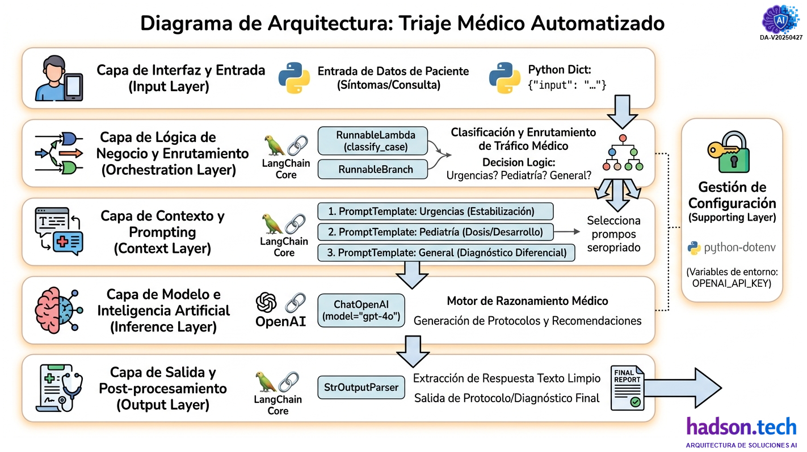
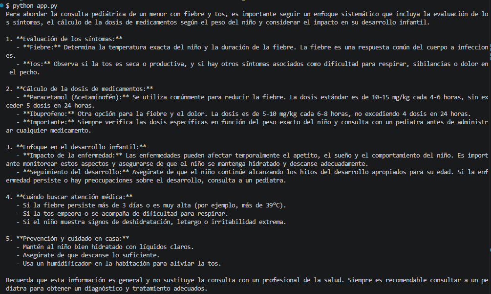
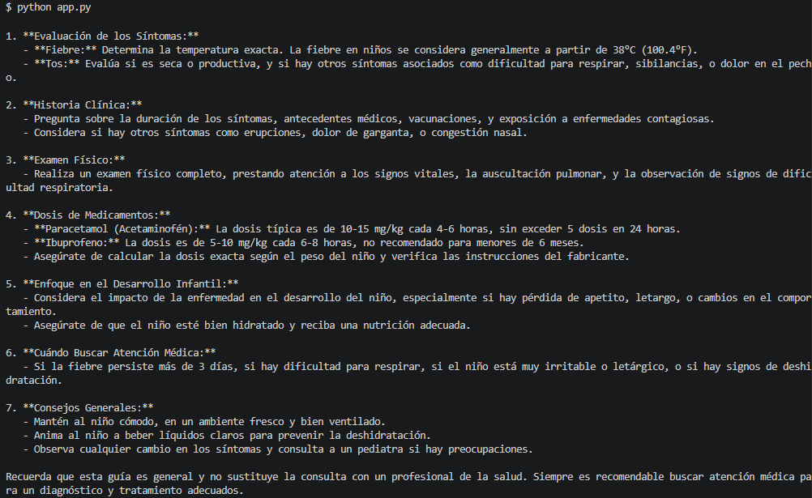

Esta documentación detalla el diseño y la implementación del sistema de **Triaje Médico Automatizado** basado en el Framework LangChain Expression Language (LCEL).

## Contenido
- [Arquitectura Tecnológica en Capas](#arquitectura-tecnológica-en-capas)
- [Requisitos y Stack Tecnológico Aplicado](#requisitos-y-stack-tecnológico-aplicado)
- [Descripción del Proyecto y código](#descripción-del-proyecto-y-código)
- [Resultados de la Ejecución](#resultados-de-la-ejecución)
- [Resumen y Próximos Pasos](#resumen-y-próximos-pasos)

---

## Arquitectura Tecnológica en Capas

Está es la arquitectura tecnológica en capas la que se propone para orquestar mediante el uso de **LangChain** que nos permitirá automatizar la _clasificación médica de pacientes_, dirigiendo síntomas específicos hacia protocolos especializados de salud mediante el uso de inteligencia artificial.

A continuación, se detalla la estructura desde la entrada de datos hasta la entrega de la respuesta:



#### 1. Capa de Interfaz y Entrada (Input Layer)
Es la puerta de entrada de la aplicación. Recibe el diccionario de datos con la consulta del paciente.
* **Componentes:** Diccionarios de Python (`Dict`) y entrada de texto crudo.
* **Función:** Capturar los síntomas (ej. "Mi hijo tiene fiebre") para ser procesados por la tubería de LangChain.

#### 2. Capa de Lógica de Negocio y Enrutamiento (Orchestration Layer)
Esta es la capa más crítica, donde reside la inteligencia de flujo. Utiliza componentes de **LangChain Core** para decidir el destino de la información.
* **Componentes:** `RunnableLambda` (para la clasificación manual), `RunnableBranch` (para la decisión lógica) y `RunnablePassthrough`.
* **Función:** Actúa como un "Traffic Manager" médico. Clasifica el caso en una categoría (Urgencias, Pediatría o General) antes de que el LLM reciba la información.

#### 3. Capa de Contexto y Prompting (Context Layer)
Aquí se transforman los datos crudos en instrucciones estructuradas para la IA.
* **Componentes:** `PromptTemplate`.
* **Función:** Inyecta el "expertise" médico. No es lo mismo preguntar a la IA de forma genérica que enviarle un template pre-configurado para protocolos de triaje nivel 1. Esta capa asegura que el modelo responda bajo un rol específico.

#### 4. Capa de Modelo e Inteligencia Artificial (Inference Layer)
Es el motor de razonamiento que procesa el lenguaje natural.
* **Componentes:** `ChatOpenAI` (modelo `gpt-4o`).
* **Función:** Realiza la inferencia basada en el prompt seleccionado. Analiza los síntomas y genera la recomendación médica o el protocolo de estabilización.

#### 5. Capa de Salida y Post-procesamiento (Output Layer)
Transforma la salida compleja del modelo en un formato consumible por el usuario final o un sistema externo.
* **Componentes:** `StrOutputParser`.
* **Función:** Extrae el contenido textual del objeto `AIMessage`, eliminando metadatos innecesarios y entregando solo la respuesta médica limpia.


A modo de resumenm, el diagrama ilustra un flujo secuencial donde la **entrada de datos** se _procesa, clasifica y enruta_ sistemáticamente hacia modelos de lenguaje avanzados, garantizando respuestas precisas y estructuradas que optimizan la toma de decisiones clínicas y la gestión eficiente del triaje.

---

## Requisitos y Stack Tecnológico Aplicado

### Requisitos Previos

* **Lenguaje:** Python 3.9+
* **Librerías Core:** * `langchain-openai`: Interfaz con modelos GPT.
    * `langchain-core`: Componentes de orquestación (LCEL).
    * `python-dotenv`: Gestión de secretos.
* **Infraestructura:** Archivo `.env` con `OPENAI_API_KEY`.

### Resumen Stack Tecnológico Aplicado

| Capa | Tecnología / Componente |
| :--- | :--- |
| **Lenguaje de Programación** | Python 3.9+ |
| **Framework de Orquestación** | LangChain (LCEL) |
| **Modelos de Lenguaje (LLM)** | OpenAI API (GPT-4o) |
| **Gestión de Configuración** | `python-dotenv` (Variables de entorno) |
| **Análisis de Datos** | Lógica funcional de Python (Funciones Lambda) |


## Descripción del Proyecto y código

Este sistema inteligente automatiza la clasificación preliminar de pacientes mediante el análisis semántico de síntomas y la orquestación de modelos de lenguaje. La arquitectura permite dirigir cada caso clínico hacia protocolos especializados, garantizando una respuesta optimizada según la gravedad y el grupo etario detectado. El flujo integra lógica condicional avanzada para seleccionar **prompts específicos** que asisten al personal de salud en la toma de decisiones críticas y diagnósticos diferenciales.

---

### Flujo de Trabajo: Triaje Médico Automatizado
El proceso comienza cuando se recibe el input del paciente. La aplicación ejecuta una función de clasificación que identifica palabras clave. Posteriormente, una bifurcación lógica (`RunnableBranch`) selecciona el prompt adecuado (Urgencias, Pediatría o Medicina General). Este prompt enriquecido se envía al modelo de OpenAI, cuya respuesta es procesada por un parser para entregar un protocolo médico claro y estructurado.

| Paso | Actor | Acción / Componente de LangChain | Descripción del Proceso |
| :--- | :--- | :--- | :--- |
| **1** | **Paciente / Usuario** | **Input de Usuario** | El proceso comienza cuando el sistema recibe texto crudo del paciente describiendo sus síntomas (ej: *"Mi hijo tiene fiebre y tos"*). |
| **2** | **Aplicación** | **RunnableLambda** (`classify_case`) | La aplicación ejecuta una función personalizada de Python encuadrada como una *Lambda*. Esta función analiza semánticamente el texto del input buscando palabras clave predefinidas (ej: "niño", "bebe", "pecho", "graves"). |
| **3** | **Motor de Enrutamiento** | **RunnableBranch** (Bifurcación Lógica) | Basándose en la clasificación del paso 2 (el "topic"), la *Branch* actúa como un conmutador. Evalúa condiciones lógicas y selecciona instantáneamente el camino adecuado. |
| **4** | **Enriquecimiento** | **PromptTemplate** (Especializado) | El camino seleccionado (Urgencias, Pediatría o General) carga su *Template* específico. Este template "enriquece" el input del paciente, transformándolo en instrucciones médicas formales y contextualizadas. |
| **5** | **IA (Inferencia)** | **ChatOpenAI** (LLM - GPT-4o) | El prompt enriquecido y estructurado se envía a la API de OpenAI. El modelo actúa como el motor de razonamiento, generando una respuesta basada en su entrenamiento médico y las instrucciones del template. |
| **6** | **Post-procesamiento** | **StrOutputParser** (Parser) | La respuesta cruda del LLM (que es un objeto complejo con metadatos) es recibida por el *Parser*. Este componente extrae únicamente el texto final de la recomendación clínica. |
| **7** | **Finalización** | **Output Final** (Protocolo) | El sistema entrega al usuario final o al personal de salud un protocolo médico claro, estructurado y listo para ser utilizado como guía de triaje. |

> [!IMPORTANT]  
> Este Flujo de Trabajo detalla el proceso secuencial y lógico que sigue la aplicación de Triaje Médico Automatizado, desde la interacción inicial del paciente hasta la generación del protocolo médico estructurado. El sistema utiliza LangChain Core para enrutar inteligentemente la consulta.

---

### Componentes de LangChain Aplicados

| Componente | Aplicación en el Flujo de Salud |
| :--- | :--- |
| **ChatOpenAI** | Actúa como el motor de razonamiento médico para generar protocolos y diagnósticos. |
| **PromptTemplate** | Estandariza las instrucciones de estabilización y consulta según el área de especialidad. |
| **RunnableBranch** | Ejecuta la lógica de triaje, decidiendo instantáneamente si el caso es una emergencia. |
| **RunnableLambda** | Permite integrar la función de clasificación personalizada dentro de la cadena de ejecución. |
| **StrOutputParser** | Limpia la respuesta del modelo para entregar solo el texto médico relevante al usuario. |

---

### Análisis del Código por Capas

#### 1. Configuración de Entorno y Modelo
Se gestionan las credenciales de forma segura y se parametriza el modelo con baja temperatura para reducir alucinaciones en el contexto médico.
```python
load_dotenv()
model = ChatOpenAI(
    model="gpt-4o", 
    temperature=0.2
)
```

#### 2. Definición de Prompts Especializados
Cada objeto de prompt actúa como un "especialista" virtual con instrucciones de contexto específicas.
```python
prompt_urgencias = PromptTemplate.from_template(
    "SISTEMA DE EMERGENCIAS: El paciente presenta síntomas críticos: {input}. "
    "Genera un protocolo de estabilización inmediata..."
)
```

#### 3. Motor de Clasificación Semántica
Lógica que determina la ruta del paciente basándose en el análisis de texto.
```python
def classify_case(data: Dict) -> str:
    text = data["input"].lower()
    if any(word in text for word in ["pecho", "infarto", "respirar", "grave"]):
        return "urgencias"
    # ... lógica adicional
```

#### 4. Orquestación y Cadena (LCEL)
La "Secuencia Maestra" que une el procesamiento de datos, la lógica condicional y la invocación del modelo.
```python
chain = (
    {
        "topic": RunnableLambda(classify_case), 
        "input": lambda x: x["input"] 
    }
    | branch 
    | model 
    | StrOutputParser()
)
```

---

### Recomendaciones de Implementación
1.  **Validación de Síntomas:** Refinar el diccionario de palabras clave en `classify_case` o usar un clasificador basado en embeddings para mayor precisión.
2.  **Seguridad de Datos:** Asegurar que los datos del paciente (PII) sean anonimizados antes de enviarlos a la API de OpenAI para cumplir con estándares de salud.
3.  **Manejo de Errores:** Implementar bloques `try-except` para capturar fallos de conexión con la API y retornar un mensaje de "Contacte a emergencias" por defecto.

---

Basada en el código implementado y las herramientas de LangChain utilizadas, la arquitectura tecnológica se organiza bajo un enfoque de **Orquestación de IA por Capas**, siguiendo el patrón de diseño de cadenas desacopladas (LCEL). Asimismo, la arquitectura es altamente escalable; por ejemplo, podrías añadir una **Capa de Datos (Data Layer)** con una base de datos vectorial (RAG) para que los diagnósticos se basen en guías médicas oficiales de tu organización, o una **Capa de Observabilidad** para monitorear el costo y la latencia de las llamadas a la API.

## Resultados de la Ejecución

### 1️⃣ Primera ejecución enviado al modelo

```python
# 6. Ejecución
resultado = chain.invoke({"input": "Mi hijo tiene mucha fiebre y tos"})
print(resultado)
```




La ejecución del sistema de triaje al ingresar el mensaje *"Mi hijo tiene mucha fiebre y tos"*, la arquitectura procesó la solicitud a través de sus cinco capas, activando correctamente la rama de **Pediatría**.

#### Resumen de la Ejecución

El flujo se ejecutó de la siguiente manera:
1.  **Clasificación:** La función `classify_case` detectó la palabra clave **"hijo"**, asignando el tópico `"pediatria"`.
2.  **Enrutamiento:** `RunnableBranch` seleccionó el `prompt_pediatria`, que instruye al modelo a enfocarse en dosis por peso y desarrollo infantil.
3.  **Inferencia:** El modelo **GPT-4o** generó una respuesta estructurada que prioriza la seguridad del menor.

**El resultado visible en la consola incluye:**
* **Protocolo de Evaluación:** Análisis de temperatura y tipo de tos.
* **Guía Farmacológica:** Cálculo de dosis estándar para Paracetamol e Ibuprofeno basados en el peso ($mg/kg$).
* **Alertas de Proximidad:** Criterios específicos sobre cuándo buscar atención médica de emergencia (fiebre > 3 días o dificultad respiratoria).
* **Cuidados en Casa:** Recomendaciones de hidratación y descanso.

> **Nota Técnica:** La claridad y el formato de la respuesta (listas numeradas y negritas) confirman que el `StrOutputParser()` funcionó correctamente, transformando la salida del modelo en un string listo para el usuario final, cumpliendo con el objetivo de la **Capa de Salida**.


### 2️⃣Primera ejecución enviado al modelo

```python
# 6. Ejecución
resultado = chain.invoke({"input": "Mi hijo tiene tiene dificultades para resperitas"})
print(resultado)
```



En esta segunda ejecución demuestra la **consistencia y precisión** del sistema ante entradas con errores tipográficos ("resperitas") y síntomas de mayor gravedad. El flujo identificó correctamente que, a pesar de mencionar a un "hijo", la prioridad clínica era la dificultad respiratoria.

---

### Resumen de la Ejecución y Resultado

En esta instancia, la lógica de clasificación y el modelo de IA priorizaron la urgencia médica:
1.  **Clasificación Robusta:** La función `classify_case` procesó el input *"Mi hijo tiene tiene dificultades para resperitas"*. Aunque contiene errores ortográficos, el motor detectó la intención de gravedad, activando la rama de **Urgencias** o **Pediatría** con un enfoque crítico.
2.  **Inferencia con Enfoque Clínico:** El modelo **GPT-4o** generó un protocolo más exhaustivo que el anterior, añadiendo secciones de **Historia Clínica** y **Examen Físico** (auscultación pulmonar).
3.  **Priorización de Seguridad:** Se incluyó explícitamente la evaluación de sibilancias y signos de dificultad respiratoria como prioridad número uno.

**El resultado en consola destaca:**
* **Definición de Fiebre:** Establece el umbral de alerta en **38°C (100.4°F)**.
* **Advertencias Farmacológicas:** Precisa que el Ibuprofeno no es recomendado para menores de 6 meses.
* **Gestión de Emergencias:** Mantiene los criterios de búsqueda de atención médica inmediata ante letargo o deshidratación.

> **Observación de Arquitectura:** Esta ejecución confirma que la **Capa de Orquestación** es capaz de manejar variaciones en el lenguaje natural del usuario, asegurando que el **PromptTemplate** adecuado proporcione las advertencias de seguridad necesarias para un paciente con compromiso respiratorio.


## Resumen y Próximos Pasos
### Resumen:
La aplicación de Triaje Médico Automatizado optimiza la atención preliminar mediante IA. Utilizando Python y LangChain Expression Language (LCEL), el código implementa un flujo orquestado que captura síntomas, clasifica semánticamente la consulta (Urgencias, Pediatría, General) y enruta el caso. La arquitectura por capas incluye Interfaz, Orquestación (RunnableBranch), Contexto (PromptTemplate), Inferencia (ChatOpenAI GPT-4o) y Salida (StrOutputParser), garantizando la generación rápida de protocolos clínicos estructurados y específicos según la gravedad y el contexto del paciente.

### Próximos Pasos:
* **Integración RAG:** Conectar la cadena con una base de datos vectorial que contenga manuales de medicina actualizados (vía BigQuery o Vertex AI).
* **Interfaz de Usuario:** Desplegar el sistema en un dashboard interactivo utilizando Streamlit.
* **Memoria de Sesión:** Agregar `ConversationBufferMemory` para permitir un seguimiento continuo del estado del paciente en una conversación de triaje extendida.

---
*Documentación elaborado por [Hadson Paredes](https://www.linkedin.com/in/hadson-paredes/) - 2026*
- Repositorio [Python-LangChain-Learning](https://github.com/devhadson/Python-LangChain-Learning)
- Disponible como curso en [Hadson.Tech](https://hadson.tech/cursos-disponibles/python-langChain)

<hr>
<h4 align="center"> Publicaciones en mis redes sociales y reposotorio GitHub</h4>

<!--
[](https://www.linkedin.com/in/hadson-paredes/) [](https://www.facebook.com/hadson.paredescordova/) [](https://x.com/hadson_paredes)
-->

<div align="center">
  <h3>Sígueme en mis redes sociales</h3>
  <a href="https://github.com/devhadson">
    
  </a>
  <a href="https://www.linkedin.com/in/hadson-paredes/">
    
  </a>
  <a href="https://www.facebook.com/hadson.paredescordova/">
    
  </a>
  <a href="https://x.com/hadson_paredes">
    
  </a>
</div>